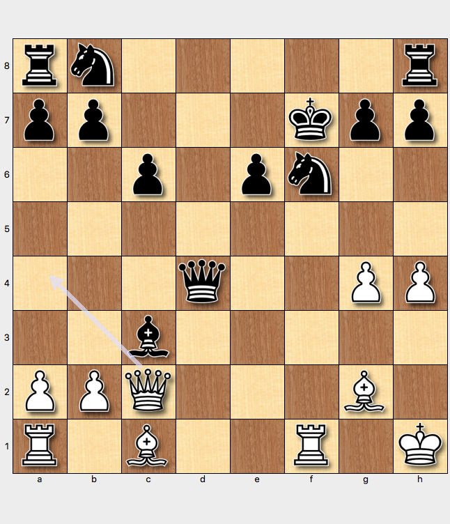

# Only you can know if the Leisebein variation is for you

In this chapter we write about an opening system to avoid asshats.

## The Feel of the BDG

Always attacking

e.g.

1. d4 d5 2. e4 dxe4 3. Nc3 Nf6 4. f3 exf3 5. Nxf3 Bf5 6. Ne5 e6 7. g4 Bg6 8. Bg2
c6 9. h4 Bb4 10. O-O Bxc2 11. Nxf7 Kxf7 12. Qxc2 Qxd4+ { - }  13. Kh1 Bxc3 14.

Bf4 { Rune Novelty!  Database wanted Rf4}   