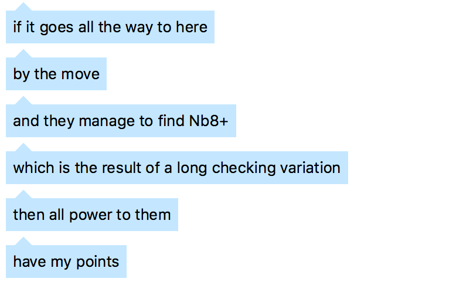

# Turn the Scotch into Two Knights

Scotch is good but it could be so much better.

## Ulvestad > your thing

Yes. It is true.

## let them eat cake

Playing the SChliemann is good for you. ivanchuk can do it. so can you

play the d5 variation even though it might be horrible because it might be saucy.

## if you have to improve the Mosquito

Theme: Qh4! 

Since the four knights variation is boring as shit.  See diagram below where white gets all the fun with bg5 after nf6 and if you want to chop BxNc3 it is even crappier...

Take up the Krause gambit!

Play bb4 and if nxe5 then nxe4! woot.  qg4 is critical with nxn and qxg and rf8 where if a3 then nxd4 and lets gooooo. 

if you see this line play d5 anyways.

http://en.lichess.org/rTTxaD2y/black#32  

We decided to take up the Malaniuk variation of the scotch!

http://chesstempo.com/gamedb/opening/1935

If Nc3 then Qh4.  If NxN and Bd3 then Qh4!

